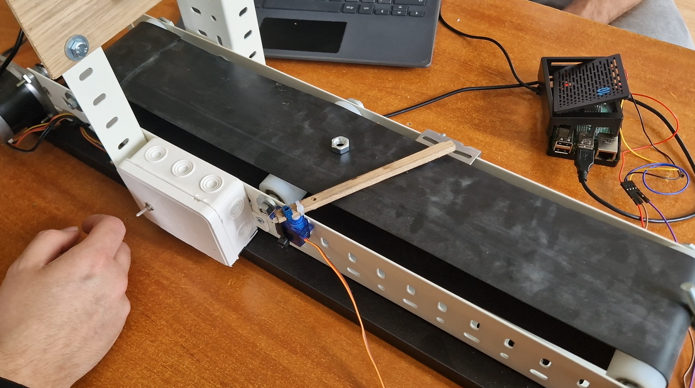
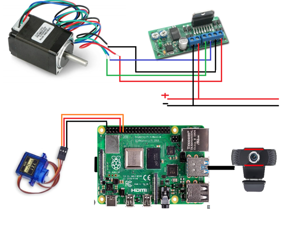

# 🥜🤖 NutriSort-Pi  
**Inteligentny system detekcji i sortowania nakrętek z użyciem YOLOv8 i Raspberry Pi**



NutriSort-Pi to w pełni zintegrowany system służący do wykrywania i sortowania nakrętek (lub innych małych obiektów) w czasie rzeczywistym. Wykorzystuje kamerę USB, Raspberry Pi, model YOLOv8 oraz komponenty mechaniczne – serwomechanizm i silnik krokowy – aby skutecznie zidentyfikować i przekierować wybrane elementy. Projekt może znaleźć zastosowanie w edukacji, automatyzacji produkcji i systemach inspekcji wizyjnej.

---

## 📁 Struktura projektu

```
custom_data/              # Surowe dane treningowe (obrazy + etykiety YOLO)
data/                     # Dane przetworzone (train/val)
runs/                     # Wyniki treningu YOLO
data.yaml                 # Konfiguracja klas i ścieżek danych
make_photos.py            # Skrypt do robienia zdjęć kamerą
project_raspberry.py      # Główny skrypt detekcji i sterowania GPIO
schema.png                # Schemat połączeń elektrycznych
train_val_split.py        # Skrypt podziału danych
Training_yolo.ipynb       # Notebook do trenowania modelu
yolov8n.pt                # Model YOLO (bazowy lub wytrenowany)
conveyor.png              # Zdjęcie stanowiska fizycznego (taśma)
```

---

## ⚙️ Etapy realizacji

1. **Konfiguracja Raspberry Pi**  
   Instalacja systemu, środowiska Python i bibliotek (`ultralytics`, `opencv-python`, `RPi.GPIO`).

2. **Tworzenie danych**  
   Użycie `make_photos.py` do robienia zdjęć obiektów z kamerki.

3. **Labelowanie danych**  
   Oznaczenie obiektów w Label Studio i eksport w formacie YOLOv8.

4. **Trenowanie modelu YOLOv8**  
   W `Training_yolo.ipynb`, z użyciem `data.yaml`. Rezultaty zapisują się w `runs/`.

5. **Wykrywanie i sterowanie**  
   Skrypt `project_raspberry.py` analizuje obraz z kamery, a gdy nakrętka znajduje się w centrum kadru – uruchamia serwo.

6. **Integracja z mechaniką**  
   Podłączenie serwomechanizmu i silnika krokowego do Raspberry Pi oraz testowanie na fizycznej taśmie.

---

## 🔩 Wykorzystane komponenty

- 🧠 Raspberry Pi 3B+ lub 4
- 🎥 Kamera USB
- 🦾 Serwomechanizm (np. SG90)
- 🔄 Silnik krokowy 12V
- ⚙️ Sterownik silnika krokowego AVT1725
- 🔌 Zasilacz, płytka stykowa, przewody

---

## 🚀 Uruchomienie

1. Instalacja zależności:
   ```bash
   pip install ultralytics opencv-python RPi.GPIO
   ```

2. Uruchomienie programu:
   ```bash
   python project_raspberry.py
   ```

3. Obiekt `"nut"` wykryty w **czerwonym okręgu** (środku obrazu) aktywuje serwo.

---

## 🧠 Model YOLOv8

- Używany model: `YOLOv8n` (lekki i szybki)
- Trening z wykorzystaniem własnych danych
- Etykiety eksportowane z Label Studio
- Konfiguracja danych: `data.yaml`

---

## 🖼️ Wizualizacje

| 📷 Stanowisko fizyczne | ⚙️ Schemat elektroniki |
|------------------------|------------------------|
|  |  |

---

## 📽️ Link do wideo demonstracyjnego

🎬 [Kliknij tutaj, aby obejrzeć demonstrację](https://youtu.be/Ah3cAaL4SCw) 

---

## 📌 Dodatkowe informacje

- Centrum obrazu oznaczone jest czerwonym okręgiem jako strefa aktywacji
- Łatwa rozbudowa o nowe klasy obiektów (`bolt`, `washer`, itp.)
- Możliwość edycji kąta obrotu serwa i parametrów detekcji

---

## 📃 Autorzy

Szymon Skrzypek
Karol Piotrowski 
Dawid Socha
Patryk Sieja
---

# 🇬🇧 NutriSort-Pi  
**Intelligent Nut Detection and Sorting System using YOLOv8 and Raspberry Pi**


NutriSort-Pi is a fully integrated real-time object detection and sorting system designed for small items like nuts. It uses a USB camera, Raspberry Pi, YOLOv8 neural network, and mechanical components (servo and stepper motor) to identify and physically sort items on a conveyor. Ideal for educational, prototyping, or automation purposes.

---

## 📁 Project Structure

```
custom_data/              # Raw training data (images + YOLO labels)
data/                     # Train/validation split
runs/                     # YOLOv8 training results
data.yaml                 # Model configuration file
make_photos.py            # Image capture script
project_raspberry.py      # Main detection + GPIO control script
schema.png                # Circuit and wiring diagram
train_val_split.py        # Dataset splitting script
Training_yolo.ipynb       # Training notebook for YOLOv8
yolov8n.pt                # Pretrained or trained YOLOv8 model
conveyor.png              # Conveyor setup photo
```

---

## ⚙️ Project Workflow

1. **Raspberry Pi setup**  
   Install Python, pip, and required libraries (`ultralytics`, `opencv-python`, `RPi.GPIO`).

2. **Image dataset creation**  
   Use `make_photos.py` to capture photos from a USB webcam.

3. **Data labeling**  
   Use Label Studio to label `"nut"` objects and export to YOLO format.

4. **Model training (YOLOv8)**  
   Train the model using `Training_yolo.ipynb` and `data.yaml`.

5. **Detection & control**  
   `project_raspberry.py` detects objects and activates a servo if a nut is in the center of the frame (red circle).

6. **Mechanical integration**  
   Connect servo and stepper to Raspberry Pi and test physical sorting.

---

## 🔩 Components Used

- 🧠 Raspberry Pi 3B+ or 4
- 🎥 USB webcam
- 🦾 Servo motor (e.g., SG90)
- 🔄 12V stepper motor
- ⚙️ Stepper motor driver (AVT1725)
- 🔌 Power supply, breadboard, jumper wires

---

## 🚀 How to Run

1. Install dependencies:
   ```bash
   pip install ultralytics opencv-python RPi.GPIO
   ```

2. Run the detection system:
   ```bash
   python project_raspberry.py
   ```

3. When a `"nut"` is detected in the center (red circle), the servo activates. 🥜➡️🔁

---

## 🧠 YOLOv8 Model

- Model: `YOLOv8n` (lightweight and efficient)
- Custom data trained using YOLOv8
- Labels generated in Label Studio
- Config via `data.yaml`

---

## 🖼️ Visuals

| 📷 Conveyor setup | ⚙️ Wiring diagram |
|------------------|------------------|
|  |  |

---

## 📽️ Demo video link

🎬 [Click here to watch the demo](https://youtu.be/Ah3cAaL4SCw) 

---
## 📌 Additional Notes

- Center of the frame marked with a red circle = activation zone
- Easily extendable to new classes (`bolt`, `washer`, etc.)
- Adjustable servo parameters and detection thresholds

---

## 📃 Authors

Szymon Skrzypek
Karol Piotrowski 
Dawid Socha
Patryk Sieja
